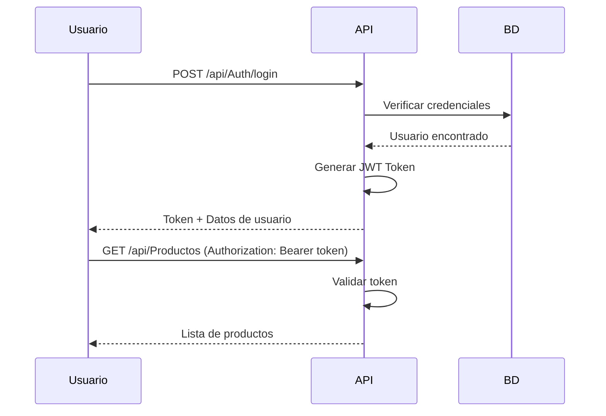

# 🍰 Pastisserie API - Sistema de Gestión para Panadería

API REST completa desarrollada en **ASP.NET Core 8.0** para la gestión integral de una panadería y pastelería local, incluyendo productos, pedidos personalizados, carrito de compras, autenticación de usuarios y sistema de entregas.

---

## 📋 Tabla de Contenidos

- [Características](#-características)
- [Tecnologías y Versiones](#-tecnologías-y-versiones)
- [Requisitos Previos](#-requisitos-previos)
- [Instalación](#-instalación)
- [Configuración](#-configuración)
- [Estructura del Proyecto](#-estructura-del-proyecto)
- [Base de Datos](#-base-de-datos)
- [Autenticación y Autorización](#-autenticación-y-autorización)
- [Endpoints Principales](#-endpoints-principales)
- [Testing](#-testing)
- [Despliegue](#-despliegue)
- [Documentación Adicional](#-documentación-adicional)

---

## ✨ Características

### **Funcionalidades Core**
- ✅ **Gestión de Productos**: CRUD completo con categorías, stock y personalización
- ✅ **Sistema de Pedidos**: Creación, seguimiento y gestión de estados
- ✅ **Productos Personalizables**: Configuración de sabores, tamaños, formas, ingredientes adicionales
- ✅ **Carrito de Compras**: Agregar, actualizar, eliminar items
- ✅ **Autenticación JWT**: Login, registro, cambio de contraseña
- ✅ **Sistema de Roles**: Usuario, Admin, Domiciliario, Gerente
- ✅ **Gestión de Envíos**: Asignación a domiciliarios y seguimiento
- ✅ **Sistema de Reseñas**: Calificaciones y comentarios en productos
- ✅ **Direcciones de Envío**: Múltiples direcciones por usuario
- ✅ **Métodos de Pago**: Gestión de métodos de pago guardados
- ✅ **Notificaciones**: Sistema de notificaciones para usuarios
- ✅ **Facturación**: Generación automática de facturas
- ✅ **Historial de Pedidos**: Auditoría de cambios de estado

### **Características Técnicas**
- 🏗️ **Clean Architecture**: Separación en capas (API, Core, Infrastructure, Services)
- 📦 **Repository Pattern**: Abstracción de acceso a datos
- 🔄 **Unit of Work**: Gestión de transacciones
- ✅ **DTOs y Validaciones**: FluentValidation para validaciones robustas
- 🗺️ **AutoMapper**: Mapeo automático entre entidades y DTOs
- 🔐 **Seguridad**: Hash de contraseñas con BCrypt, tokens JWT
- 📊 **Swagger/OpenAPI**: Documentación interactiva de la API
- 🌐 **CORS**: Configurado para desarrollo

---

## 🛠️ Tecnologías y Versiones

### **Framework y Lenguaje**
| Tecnología | Versión | Propósito |
|------------|---------|-----------|
| .NET SDK | 8.0 | Framework principal |
| C# | 12 | Lenguaje de programación |
| ASP.NET Core Web API | 8.0 | Framework web |

### **Base de Datos y ORM**
| Tecnología | Versión | Propósito |
|------------|---------|-----------|
| SQL Server | 2022 Express | Base de datos relacional |
| Entity Framework Core | 8.0.0 | ORM (Object-Relational Mapping) |
| EF Core SQL Server Provider | 8.0.0 | Proveedor para SQL Server |
| EF Core Tools | 8.0.0 | Herramientas de migración |
| EF Core Design | 8.0.0 | Herramientas de diseño |

### **Seguridad y Autenticación**
| Paquete | Versión | Propósito |
|---------|---------|-----------|
| Microsoft.AspNetCore.Authentication.JwtBearer | 8.0.0 | Autenticación JWT |
| System.IdentityModel.Tokens.Jwt | 8.0.0 | Generación de tokens JWT |
| BCrypt.Net-Next | 4.0.3 | Hash de contraseñas |

### **Validación y Mapeo**
| Paquete | Versión | Propósito |
|---------|---------|-----------|
| FluentValidation | 11.9.0 | Validaciones de modelos |
| FluentValidation.DependencyInjectionExtensions | 11.9.0 | Integración con DI |
| AutoMapper | 13.0.1 | Mapeo objeto-objeto |
| AutoMapper.Extensions.Microsoft.DependencyInjection | 13.0.1 | Integración con DI |

### **Documentación**
| Paquete | Versión | Propósito |
|---------|---------|-----------|
| Swashbuckle.AspNetCore | 6.6.2 | Generación de Swagger UI |

### **Otros Paquetes**
| Paquete | Versión | Propósito |
|---------|---------|-----------|
| Microsoft.Data.SqlClient | 5.2.2 | Cliente SQL Server |
| System.ComponentModel.Annotations | 8.0.0 | Anotaciones de datos |

---

## 📥 Requisitos Previos

### **Software Necesario**

#### **1. .NET SDK 8.0**
- **Descargar:** https://dotnet.microsoft.com/download/dotnet/8.0
- **Verificar instalación:**
  ```bash
  dotnet --version
  # Debe mostrar: 8.0.x
  ```

#### **2. SQL Server 2022 Express Edition**
- **Descargar:** https://www.microsoft.com/es-es/sql-server/sql-server-downloads
- **Seleccionar:** Express Edition (Gratis)
- **Incluye:** SQL Server Management Studio (SSMS)

#### **3. SQL Server Management Studio (SSMS)** *(Opcional pero recomendado)*
- **Descargar:** https://learn.microsoft.com/en-us/sql/ssms/download-sql-server-management-studio-ssms
- **Versión:** 19.x o superior

#### **4. Visual Studio 2022 Community** *(Recomendado)*
- **Descargar:** https://visualstudio.microsoft.com/es/downloads/
- **Workloads a instalar:**
  - ✅ ASP.NET y desarrollo web
  - ✅ Desarrollo de .NET multiplataforma
  - ✅ Almacenamiento y procesamiento de datos

#### **5. Postman** *(Opcional - para testing de API)*
- **Descargar:** https://www.postman.com/downloads/

#### **6. Git**
- **Descargar:** https://git-scm.com/downloads

---

## 🚀 Instalación

### **Paso 1: Clonar el Repositorio**

```bash
git clone https://github.com/TU_USUARIO/Patisserie-s-Deluxe.git
cd Patisserie-s-Deluxe/Proyecto_Code/Backend/PastisserieAPI
```

### **Paso 2: Restaurar Paquetes NuGet**

```bash
dotnet restore
```

### **Paso 3: Compilar el Proyecto**

```bash
dotnet build
```

---

## ⚙️ Configuración

### **Paso 1: Configurar Connection String**

1. Copia el archivo de ejemplo:
   ```bash
   cp PastisserieAPI.API/appsettings.Example.json PastisserieAPI.API/appsettings.json
   ```

2. Edita `appsettings.json` y actualiza:

```json
{
  "ConnectionStrings": {
    "DefaultConnection": "Server=localhost\\SQLEXPRESS;Database=PastisserieDB;Trusted_Connection=True;TrustServerCertificate=True;MultipleActiveResultSets=true"
  },
  "JwtSettings": {
    "SecretKey": "TuClaveSecretaSuperSeguraDeAlMenos32CaracteresParaPastisserieAPI2026",
    "Issuer": "PastisserieAPI",
    "Audience": "PastisserieClients",
    "ExpirationMinutes": 60
  }
}
```

**Notas importantes:**
- **SQL Server Local:** Usa `localhost\\SQLEXPRESS`
- **SQL Server con autenticación SQL:** `Server=localhost;Database=PastisserieDB;User Id=sa;Password=TuPassword;`
- **Cambia `SecretKey`** por una clave segura única

### **Paso 2: Crear la Base de Datos**

#### **Opción A: Usando EF Core Migrations (Recomendado)**

```bash
# Crear la migración inicial
dotnet ef migrations add InitialCreate --project PastisserieAPI.Infrastructure --startup-project PastisserieAPI.API

# Aplicar la migración (crea la BD y tablas)
dotnet ef database update --project PastisserieAPI.Infrastructure --startup-project PastisserieAPI.API
```

#### **Opción B: Verificar migraciones existentes**

Si ya hay migraciones en el proyecto:

```bash
# Listar migraciones
dotnet ef migrations list --project PastisserieAPI.Infrastructure --startup-project PastisserieAPI.API

# Aplicar migraciones
dotnet ef database update --project PastisserieAPI.Infrastructure --startup-project PastisserieAPI.API
```

#### **Comandos Útiles de Migrations**

```bash
# Eliminar última migración
dotnet ef migrations remove --project PastisserieAPI.Infrastructure --startup-project PastisserieAPI.API

# Revertir a una migración específica
dotnet ef database update NombreMigracion --project PastisserieAPI.Infrastructure --startup-project PastisserieAPI.API

# Eliminar base de datos
dotnet ef database drop --project PastisserieAPI.Infrastructure --startup-project PastisserieAPI.API --force

# Generar script SQL de las migraciones
dotnet ef migrations script --project PastisserieAPI.Infrastructure --startup-project PastisserieAPI.API --output migration.sql
```

### **Paso 3: Crear Usuario Administrador**

La base de datos incluye datos semilla (roles, categorías, ingredientes, métodos de pago), pero el usuario administrador debe crearse manualmente por seguridad.

#### **Instrucciones Completas:**

1. Ve a la carpeta: `PastisserieAPI.API/Database/Scripts/`
2. Abre el archivo: `README.md` para instrucciones detalladas
3. Ejecuta el script: `01_CreateAdminUser.sql` siguiendo los pasos del README

#### **Resumen del Proceso:**

```sql
-- 1. Ejecutar el script una primera vez para generar contraseña aleatoria
-- 2. Copiar la contraseña generada
-- 3. Generar hash BCrypt en: https://bcrypt-generator.com/ (rounds: 11)
-- 4. Actualizar el script con el hash
-- 5. Ejecutar nuevamente el script completo
```

**Resultado:** Usuario `admin@pastisserie.com` con rol de Administrador.

---

## 📁 Estructura del Proyecto

```
PastisserieAPI/
├── PastisserieAPI.sln                    # Solución principal
├── .gitignore                            # Archivos ignorados por Git
├── README.md                             # Este archivo
│
├── PastisserieAPI.API/                   # 🌐 Capa de Presentación
│   ├── Controllers/                      # Controladores REST
│   │   ├── AuthController.cs            # Autenticación (login, register)
│   │   ├── ProductosController.cs       # CRUD de productos
│   │   └── CarritoController.cs         # Carrito de compras
│   ├── Database/                         # Scripts de base de datos
│   │   └── Scripts/
│   │       ├── 01_CreateAdminUser.sql   # Crear administrador
│   │       ├── BCryptHashGenerator.cs   # Generador de hash
│   │       └── README.md                # Instrucciones detalladas
│   ├── Properties/
│   │   └── launchSettings.json          # Configuración de ejecución
│   ├── appsettings.json                 # Configuración (NO SUBIR A GIT)
│   ├── appsettings.Example.json         # Plantilla de configuración
│   ├── Program.cs                       # Punto de entrada
│   └── PastisserieAPI.API.csproj        # Archivo de proyecto
│
├── PastisserieAPI.Core/                  # 🎯 Capa de Dominio
│   ├── Entities/                         # Entidades del modelo
│   │   ├── User.cs                      # Usuario
│   │   ├── Producto.cs                  # Producto
│   │   ├── Pedido.cs                    # Pedido
│   │   ├── CarritoCompra.cs             # Carrito
│   │   ├── Review.cs                    # Reseña
│   │   └── ... (20 entidades total)
│   ├── Enums/                            # Enumeraciones
│   │   ├── EstadoPedido.cs
│   │   ├── EstadoEnvio.cs
│   │   ├── TipoNotificacion.cs
│   │   └── TipoRol.cs
│   ├── Interfaces/                       # Contratos
│   │   ├── IUnitOfWork.cs               # Unit of Work
│   │   └── Repositories/                 # Interfaces de repositorios
│   │       ├── IRepository.cs           # Repositorio genérico
│   │       ├── IUserRepository.cs
│   │       ├── IProductoRepository.cs
│   │       └── ... (7 interfaces)
│   └── PastisserieAPI.Core.csproj
│
├── PastisserieAPI.Infrastructure/        # 🗄️ Capa de Infraestructura
│   ├── Data/                             # Contexto de base de datos
│   │   ├── ApplicationDbContext.cs      # DbContext principal
│   │   ├── ApplicationDbContextFactory.cs # Factory para migrations
│   │   └── Configurations/               # Configuraciones Fluent API
│   │       ├── UserConfiguration.cs
│   │       ├── ProductoConfiguration.cs
│   │       └── PedidoConfiguration.cs
│   ├── Migrations/                       # Migraciones de EF Core
│   │   ├── 20260201XXXXXX_InitialCreate.cs
│   │   └── ApplicationDbContextModelSnapshot.cs
│   ├── Repositorie/                      # Implementaciones
│   │   ├── Repository.cs                # Repositorio genérico
│   │   ├── UnitOfWork.cs                # Unit of Work
│   │   ├── UserRepository.cs
│   │   ├── ProductoRepository.cs
│   │   └── ... (7 repositorios)
│   └── PastisserieAPI.Infrastructure.csproj
│
└── PastisserieAPI.Services/              # 💼 Capa de Aplicación
    ├── DTOs/                             # Data Transfer Objects
    │   ├── Common/                       # DTOs compartidos
    │   │   ├── ApiResponse.cs           # Respuesta estándar
    │   │   └── PaginationDto.cs         # Paginación
    │   ├── Request/                      # DTOs de entrada
    │   │   ├── RegisterRequestDto.cs
    │   │   ├── LoginRequestDto.cs
    │   │   ├── CreateProductoRequestDto.cs
    │   │   ├── CreatePedidoRequestDto.cs
    │   │   └── ... (15+ DTOs)
    │   └── Response/                     # DTOs de salida
    │       ├── UserResponseDto.cs
    │       ├── LoginResponseDto.cs
    │       ├── ProductoResponseDto.cs
    │       └── ... (10+ DTOs)
    ├── Validators/                       # Validadores FluentValidation
    │   ├── RegisterRequestValidator.cs
    │   ├── LoginRequestValidator.cs
    │   ├── CreateProductoRequestValidator.cs
    │   └── ... (8+ validadores)
    ├── Mappings/                         # Perfiles de AutoMapper
    │   └── MappingProfile.cs            # Mapeos entre entidades y DTOs
    ├── Services/                         # Servicios de negocio
    │   ├── Interfaces/
    │   │   ├── IAuthService.cs
    │   │   ├── IProductoService.cs
    │   │   ├── IPedidoService.cs
    │   │   └── ICarritoService.cs
    │   ├── AuthService.cs               # Lógica de autenticación
    │   ├── ProductoService.cs           # Lógica de productos
    │   ├── PedidoService.cs             # Lógica de pedidos
    │   └── CarritoService.cs            # Lógica de carrito
    ├── Helpers/
    │   └── JwtHelper.cs                 # Generación de tokens JWT
    └── PastisserieAPI.Services.csproj
```

---

## 🗄️ Base de Datos

### **Diagrama de Entidades (20 Tablas)**

#### **Módulo de Usuarios y Autenticación**
- `Users` - Usuarios del sistema
- `Roles` - Catálogo de roles (Usuario, Admin, Domiciliario, Gerente)
- `UserRoles` - Relación N:N entre usuarios y roles

#### **Módulo de Productos**
- `Productos` - Catálogo de productos
- `CategoriasProducto` - Categorías de productos
- `Reviews` - Reseñas de productos

#### **Módulo de Pedidos**
- `Pedidos` - Órdenes de compra
- `PedidoItems` - Detalle de productos por pedido
- `PedidoHistoriales` - Auditoría de cambios de estado
- `Facturas` - Facturación

#### **Módulo de Personalización**
- `PersonalizadoConfigs` - Configuración de productos personalizados
- `Ingredientes` - Ingredientes disponibles
- `PersonalizadoConfigIngredientes` - Relación N:N ingredientes-configuración

#### **Módulo de Carrito**
- `CarritosCompra` - Carrito por usuario
- `CarritoItems` - Items en el carrito

#### **Módulo de Pagos**
- `TiposMetodoPago` - Catálogo de métodos de pago
- `MetodosPagoUsuario` - Métodos de pago guardados por usuario

#### **Módulo de Envíos**
- `DireccionesEnvio` - Direcciones de entrega
- `Envios` - Gestión de entregas

#### **Módulo de Notificaciones**
- `Notificaciones` - Notificaciones del sistema

### **Datos Semilla (Seed Data)**

Al ejecutar las migraciones, se crean automáticamente:

#### **4 Roles:**
- Usuario
- Admin
- Domiciliario
- Gerente

#### **5 Tipos de Método de Pago:**
- Efectivo
- Tarjeta de Crédito
- Tarjeta de Débito
- Transferencia
- PSE

#### **5 Categorías de Productos:**
- Tortas
- Panes
- Postres
- Galletas
- Personalizados

#### **7 Ingredientes para Personalización:**
- Arequipe ($5,000)
- Crema de chocolate ($7,000)
- Fresas frescas ($8,000)
- Frutas mixtas ($10,000)
- Chispas de chocolate ($3,000)
- Nueces ($6,000)
- Coco rallado ($4,000)

### **Scripts SQL Disponibles**

Ubicación: `PastisserieAPI.API/Database/Scripts/`

1. **01_CreateAdminUser.sql** - Crear usuario administrador
2. **BCryptHashGenerator.cs** - Generador de hash BCrypt (C#)
3. **README.md** - Instrucciones detalladas

---

## 🔐 Autenticación y Autorización

### **Sistema de Autenticación**

La API utiliza **JSON Web Tokens (JWT)** para autenticación stateless.

#### **Flujo de Autenticación:**



#### **Endpoints de Autenticación:**

| Endpoint | Método | Descripción | Autenticación |
|----------|--------|-------------|---------------|
| `/api/Auth/register` | POST | Registrar nuevo usuario | No |
| `/api/Auth/login` | POST | Iniciar sesión | No |
| `/api/Auth/profile` | GET | Obtener perfil | Sí |
| `/api/Auth/change-password` | POST | Cambiar contraseña | Sí |
| `/api/Auth/verify` | GET | Verificar token | Sí |

### **Sistema de Roles y Permisos**

#### **Roles Disponibles:**

| Rol | Permisos | Descripción |
|-----|----------|-------------|
| **Usuario** | - Ver productos<br>- Crear pedidos<br>- Gestionar carrito<br>- Ver historial | Cliente estándar |
| **Admin** | - Acceso total<br>- Gestionar usuarios<br>- Gestionar productos<br>- Ver reportes | Administrador del sistema |
| **Domiciliario** | - Ver pedidos asignados<br>- Actualizar estado de envío<br>- Ver direcciones | Repartidor |
| **Gerente** | - Ver reportes<br>- Aprobar pedidos<br>- Gestionar productos<br>- Ver estadísticas | Supervisor de operaciones |

#### **Uso de Autorización en Controladores:**

```csharp
// Solo usuarios autenticados
[Authorize]
[HttpGet("profile")]
public async Task<IActionResult> GetProfile() { }

// Solo administradores
[Authorize(Roles = "Admin")]
[HttpPost]
public async Task<IActionResult> CreateProducto() { }

// Múltiples roles
[Authorize(Roles = "Admin,Gerente")]
[HttpPost("aprobar/{id}")]
public async Task<IActionResult> AprobarPedido(int id) { }
```

### **Configuración de JWT**

En `appsettings.json`:

```json
{
  "JwtSettings": {
    "SecretKey": "TuClaveSecretaSuperSeguraDeAlMenos32Caracteres",
    "Issuer": "PastisserieAPI",
    "Audience": "PastisserieClients",
    "ExpirationMinutes": 60
  }
}
```

**Parámetros:**
- **SecretKey:** Clave para firmar tokens (mínimo 32 caracteres)
- **Issuer:** Emisor del token
- **Audience:** Audiencia del token
- **ExpirationMinutes:** Tiempo de expiración (60 minutos)

### **Seguridad de Contraseñas**

- **Algoritmo:** BCrypt con 11 rounds
- **Validaciones:**
  - Mínimo 6 caracteres
  - Al menos 1 mayúscula
  - Al menos 1 minúscula
  - Al menos 1 número

---

## 🌐 Endpoints Principales

### **Base URL**
- **Desarrollo:** `https://localhost:7001` o `http://localhost:5001`
- **Swagger UI:** `https://localhost:7001/swagger`

### **Autenticación** (`/api/Auth`)

| Endpoint | Método | Descripción | Auth | Body |
|----------|--------|-------------|------|------|
| `/register` | POST | Registro de usuario | No | `RegisterRequestDto` |
| `/login` | POST | Inicio de sesión | No | `LoginRequestDto` |
| `/profile` | GET | Obtener perfil | Sí | - |
| `/change-password` | POST | Cambiar contraseña | Sí | `ChangePasswordRequestDto` |
| `/verify` | GET | Verificar token | Sí | - |

### **Productos** (`/api/Productos`)

| Endpoint | Método | Descripción | Auth | Roles |
|----------|--------|-------------|------|-------|
| `/` | GET | Listar productos | No | - |
| `/{id}` | GET | Obtener producto | No | - |
| `/` | POST | Crear producto | Sí | Admin |
| `/{id}` | PUT | Actualizar producto | Sí | Admin |
| `/{id}` | DELETE | Eliminar producto | Sí | Admin |
| `/activos` | GET | Productos activos | No | - |
| `/categoria/{categoria}` | GET | Por categoría | No | - |

### **Carrito** (`/api/Carrito`)

| Endpoint | Método | Descripción | Auth |
|----------|--------|-------------|------|
| `/` | GET | Ver carrito | Sí |
| `/items` | POST | Agregar item | Sí |
| `/items/{id}` | PUT | Actualizar cantidad | Sí |
| `/items/{id}` | DELETE | Eliminar item | Sí |
| `/clear` | DELETE | Vaciar carrito | Sí |

### **Pedidos** (`/api/Pedidos`)

| Endpoint | Método | Descripción | Auth | Roles |
|----------|--------|-------------|------|-------|
| `/` | POST | Crear pedido | Sí | - |
| `/{id}` | GET | Obtener pedido | Sí | - |
| `/usuario/{id}` | GET | Pedidos de usuario | Sí | - |
| `/{id}/estado` | PUT | Actualizar estado | Sí | Admin, Gerente |
| `/{id}/aprobar` | POST | Aprobar pedido | Sí | Gerente |

### **Formato de Respuestas**

Todas las respuestas siguen este formato estándar:

```json
{
  "success": true,
  "message": "Operación exitosa",
  "data": { ... },
  "errors": []
}
```

**Códigos de Estado HTTP:**
- `200 OK` - Operación exitosa
- `201 Created` - Recurso creado
- `400 Bad Request` - Error de validación
- `401 Unauthorized` - No autenticado
- `403 Forbidden` - Sin permisos
- `404 Not Found` - Recurso no encontrado
- `500 Internal Server Error` - Error del servidor

---

## 🧪 Testing

### **Probar con Swagger UI**

1. Ejecutar el proyecto:
   ```bash
   dotnet run --project PastisserieAPI.API
   ```

2. Abrir navegador en: `https://localhost:7001/swagger`

3. **Autenticarse:**
   - Ejecutar `POST /api/Auth/login`
   - Copiar el `token` de la respuesta
   - Hacer clic en el botón **Authorize** 🔓
   - Ingresar: `Bearer {token}`
   - Hacer clic en **Authorize** y **Close**

4. **Probar endpoints protegidos**

### **Probar con Postman**

#### **Colección de Pruebas:**

```json
{
  "info": {
    "name": "Pastisserie API",
    "schema": "https://schema.getpostman.com/json/collection/v2.1.0/collection.json"
  },
  "auth": {
    "type": "bearer",
    "bearer": [
      {
        "key": "token",
        "value": "{{jwt_token}}",
        "type": "string"
      }
    ]
  }
}
```

#### **Variables de Entorno:**

```json
{
  "base_url": "https://localhost:7001",
  "jwt_token": "",
  "admin_email": "admin@pastisserie.com"
}
```

### **Casos de Prueba Esenciales**

#### **1. Autenticación**
```bash
# Registro
POST {{base_url}}/api/Auth/register
{
  "nombre": "Test User",
  "email": "test@test.com",
  "password": "Test123",
  "confirmPassword": "Test123"
}

# Login
POST {{base_url}}/api/Auth/login
{
  "email": "admin@pastisserie.com",
  "password": "TuPasswordAdmin"
}
```

#### **2. Productos**
```bash
# Crear producto (requiere token de Admin)
POST {{base_url}}/api/Productos
Authorization: Bearer {{jwt_token}}
{
  "nombre": "Torta Red Velvet",
  "precio": 50000,
  "stock": 10,
  "categoria": "Tortas"
}

# Listar productos (público)
GET {{base_url}}/api/Productos
```

#### **3. Carrito**
```bash
# Agregar al carrito (requiere token)
POST {{base_url}}/api/Carrito/items
Authorization: Bearer {{jwt_token}}
{
  "productoId": 1,
  "cantidad": 2
}
```

---

## 🚀 Despliegue

### **Preparación para Producción**

#### **1. Configuración de Entorno**

Usar variables de entorno en lugar de `appsettings.json`:

```bash
# Linux/Mac
export ConnectionStrings__DefaultConnection="Server=..."
export JwtSettings__SecretKey="..."

# Windows PowerShell
$env:ConnectionStrings__DefaultConnection="Server=..."
$env:JwtSettings__SecretKey="..."
```

#### **3. Configurar IIS (Windows Server)**

1. Instalar **.NET 8.0 Hosting Bundle**
2. Crear Application Pool con **.NET CLR Version: No Managed Code**
3. Configurar sitio web apuntando a la carpeta `publish`
4. Configurar variables de entorno en IIS

#### **4. Azure App Service**
```bash
# Instalar Azure CLI
# Publicar a Azure
az webapp up --name pastisserie-api --resource-group mi-grupo
```

### **Checklist de Seguridad**

- [ ] ✅ Cambiar `SecretKey` de JWT
- [ ] ✅ Usar variables de entorno para secretos
- [ ] ✅ Habilitar HTTPS obligatorio
- [ ] ✅ Configurar CORS solo para dominios permitidos
- [ ] ✅ Cambiar contraseña del administrador
- [ ] ✅ Habilitar rate limiting
- [ ] ✅ Configurar logs centralizados
- [ ] ✅ Implementar backup de base de datos
- [ ] ✅ Deshabilitar Swagger en producción

---

## 📚 Documentación Adicional

### **Archivos de Documentación**

- `Database/Scripts/README.md` - Instrucciones para crear administrador
- `appsettings.Example.json` - Plantilla de configuración
- Este `README.md` - Documentación principal

### **Recursos de Aprendizaje**

#### **Documentación Oficial:**
- [ASP.NET Core](https://learn.microsoft.com/es-es/aspnet/core/)
- [Entity Framework Core](https://learn.microsoft.com/es-es/ef/core/)
- [FluentValidation](https://docs.fluentvalidation.net/)
- [AutoMapper](https://docs.automapper.org/)
- [JWT Authentication](https://jwt.io/introduction)

#### **Arquitectura:**
- [Clean Architecture](https://blog.cleancoder.com/uncle-bob/2012/08/13/the-clean-architecture.html)
- [Repository Pattern](https://learn.microsoft.com/es-es/dotnet/architecture/microservices/microservice-ddd-cqrs-patterns/infrastructure-persistence-layer-design)
- [Unit of Work Pattern](https://learn.microsoft.com/es-es/aspnet/mvc/overview/older-versions/getting-started-with-ef-5-using-mvc-4/implementing-the-repository-and-unit-of-work-patterns-in-an-asp-net-mvc-application)

---

## 🐛 Solución de Problemas Comunes

### **Error: "Cannot open database"**

**Causa:** SQL Server no está corriendo o connection string incorrecto

**Solución:**
```bash
# Verificar servicio SQL Server
services.msc -> SQL Server (SQLEXPRESS) -> Iniciar

# Verificar connection string en appsettings.json
```

### **Error: "Failed to fetch" en Swagger**

**Causa:** Problema de CORS o HTTPS

**Solución:**
```bash
# Usar HTTP en lugar de HTTPS en desarrollo
# Acceder a: http://localhost:5001/swagger
```

### **Error: "Roles vacíos al registrar usuario"**

**Causa:** No se asignó el rol por defecto

**Solución:**
- Verificar que existe el rol "Usuario" en la tabla `Roles`
- Revisar el método `RegisterAsync` en `AuthService.cs`

### **Error al ejecutar migraciones**
```bash
# Limpiar y reconstruir
dotnet clean
dotnet restore
dotnet build

# Eliminar carpeta Migrations y recrear
dotnet ef migrations add InitialCreate --project PastisserieAPI.Infrastructure --startup-project PastisserieAPI.API
```

---

## 📝 Changelog

### **v1.0.0 - Febrero 2026**
- ✅ Implementación inicial del backend
- ✅ Autenticación JWT completa
- ✅ CRUD de productos
- ✅ Sistema de pedidos
- ✅ Carrito de compras
- ✅ Sistema de roles
- ✅ Productos personalizables
- ✅ Base de datos con 20 entidades
- ✅ Validaciones con FluentValidation
- ✅ Documentación Swagger

---

## 👥 Contribución

Este es un proyecto académico del SENA. Para contribuir:

1. Fork el repositorio
2. Crea una rama: `git checkout -b feature/nueva-funcionalidad`
3. Commit: `git commit -m 'feat: agregar nueva funcionalidad'`
4. Push: `git push origin feature/nueva-funcionalidad`
5. Abre un Pull Request

### **Convenciones de Commits**

- `feat:` Nueva funcionalidad
- `fix:` Corrección de bugs
- `docs:` Documentación
- `refactor:` Refactorización de código
- `test:` Pruebas
- `chore:` Tareas de mantenimiento

---

## 📄 Licencia

Este proyecto es parte de un trabajo académico del **SENA (Servicio Nacional de Aprendizaje)** para el programa de formación en desarrollo de software.

**Propósito:** Educativo  
**Año:** 2026  
**Institución:** SENA - Centro de Servicios y Gestión Empresarial

---

## 📞 Contacto y Soporte

**Desarrollado por:** Equipo Pastisserie Deluxe  
**Institución:** SENA  
**Programa:** Análisis y Desarrollo de Software  

Para preguntas o reportar problemas:
- 📧 Email: [Tu email aquí]
- 🐛 Issues: [GitHub Issues](https://github.com/TU_USUARIO/Patisserie-s-Deluxe/issues)

---

## 🙏 Agradecimientos

- **SENA** por la formación en desarrollo de software
- **Microsoft** por las herramientas y documentación
- **Comunidad de desarrolladores** por los recursos open source

---

<div align="center">

**🍰 Desarrollado con ❤️ para Pastisserie Deluxe 🍰**

*"Endulzando vidas, un pedido a la vez"*

---

**[⬆ Volver arriba](#-pastisserie-api---sistema-de-gestión-para-panadería)**

</div></parameter>
